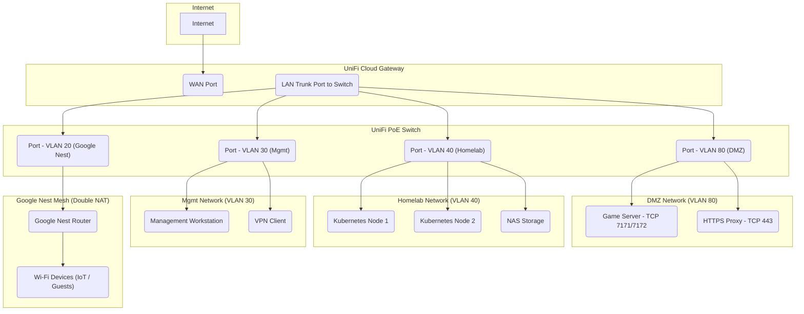
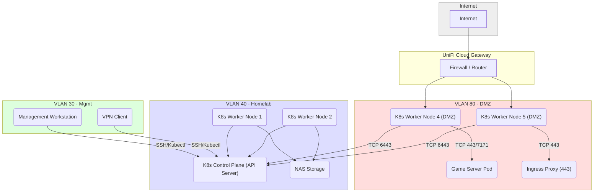

### VLAN Layout & Firewalling

| VLAN ID | Name  | Devices              | Example Use                        |
| ------- | ----- | -------------------- | ---------------------------------- |
| 10      | Home  | Phones, TVs, laptops | General internet browsing          |
| 20      | Guest | Visitors’ phones     | No LAN access (internet only)      |
| 30      | Mgmt  | Your workstation     | Consoles, admin & SSH etc...       |
| 40      | Lab   | K8s nodes, NAS       | Routed via firewall rules          |
| 50      | IoT   | Cameras, sensors     | Blocked from accessing other VLANs |

