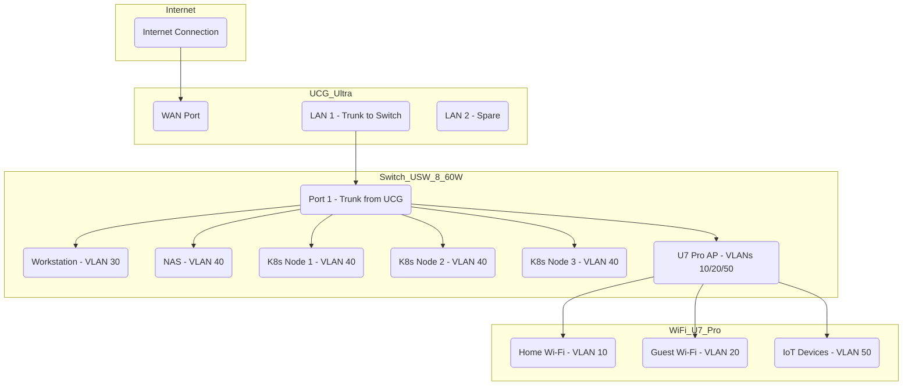

## Server Rack
### Server Racks
GeeekPi 12U Server Cabinet, 10 inch Server Rack
- Dimensions:  639mm x 281mm x 260mm
- Price: [$200.00](https://www.amazon.com/GeeekPi-Cabinet-Equipment-RackMate-Rackmount/dp/B0DT2XM22G)

### Rack Mounts
- [10 Inch Rack Mount for Ubiquiti Unifi Cloud Gateway Ultra / Gateway Max  - $75](https://www.etsy.com/au/listing/1685437465/10-inch-rack-mount-for-ubiquiti-unifi?ls=s&ga_order=most_relevant&ga_search_type=all&ga_view_type=gallery&ga_search_query=10+Inch+Rack+Mount+for+Ubiquiti+Unifi+cloud+gateway&ref=sr_gallery-1-1&sts=1&local_signal_search=1&content_source=4db99f1e7125ca67e42567545f58addd0e04fe6c%253A1685437465&search_preloaded_img=1&organic_search_click=1&logging_key=4db99f1e7125ca67e42567545f58addd0e04fe6c%3A1685437465&variation0=4330146583)
- [10 Inch Rack Mount for Ubiquiti Unifi Switch 8 Lite PoE - $50](https://www.etsy.com/au/listing/1477633123/10-inch-rack-mount-for-ubiquiti-unifi?ref=search2_top_narrowing_intent_modules_top_rated-6&sts=1&logging_key=04bf0f63713a34cca57a7eeffdc720a1f55f47ed%3A1477633123)
- [10 Inch Rack mount for Lenovo ThinkCentre M Series - $90.00](https://www.etsy.com/au/listing/1410413576/10-inch-rack-mount-for-lenovo?q=M910Q+10%26quot%3B&ls=s&ga_order=most_relevant&ga_search_type=all&ga_view_type=gallery&ga_search_query=M910Q+10%26quot%3B&ref=sr_gallery-1-2&sts=1&local_signal_search=1&content_source=8b904773204cdfa5bd0096771c290aff6fcb6882%253A1410413576&search_preloaded_img=1&organic_search_click=1&logging_key=8b904773204cdfa5bd0096771c290aff6fcb6882%3A1410413576)

---

## Networking
### Hardware
#### Router
[Ubiquiti Cloud Gateway Ultra](https://techspecs.ui.com/unifi/cloud-gateways/ucg-ultra?subcategory=all-cloud-gateways)
Price: [$203.00](https://www.amazon.com.au/gp/product/B0DMWVMMNC?smid=ANEGB3WVEVKZB&psc=1)
#### Switch
[Ubiquiti Lite 8 PoE Layer 2 Switch](https://techspecs.ui.com/unifi/switching/usw-lite-8-poe?subcategory=all-switching)
Price: [$222.00](https://www.amazon.com.au/gp/product/B0C6BPKXDF?smid=ANEGB3WVEVKZB&psc=1)
#### Wifi Access Points
Google Nest WiFi Router(s)
Prices: [$290.00](https://www.amazon.com.au/Google-Nest-WiFi-Router-Points/dp/B081S25J9M?mcid=253c4732736f30f182d09d8b72b9eafc&tag=googleshopdsk-22&linkCode=df0&hvadid=712357308389&hvpos=&hvnetw=g&hvrand=12663702099694500129&hvpone=&hvptwo=&hvqmt=&hvdev=c&hvdvcmdl=&hvlocint=&hvlocphy=9070580&hvtargid=pla-853102050846&psc=1)

### VLAN Layout & Firewalling

| VLAN ID | Name  | Devices              | Example Use                        |
| ------- | ----- | -------------------- | ---------------------------------- |
| 10      | Home  | Phones, TVs, laptops | General internet browsing          |
| 20      | Guest | Visitors’ phones     | No LAN access (internet only)      |
| 30      | Mgmt  | Your workstation     | Consoles, admin & SSH etc...       |
| 40      | Lab   | K8s nodes, NAS       | Routed via firewall rules          |
| 50      | IoT   | Cameras, sensors     | Blocked from accessing other VLANs |

---

Required for initting cluster:  
https://www.apple.com/au/shop/product/HRG32ZM/A/belkin-usb-c-to-25gb-ethernet-adapter
